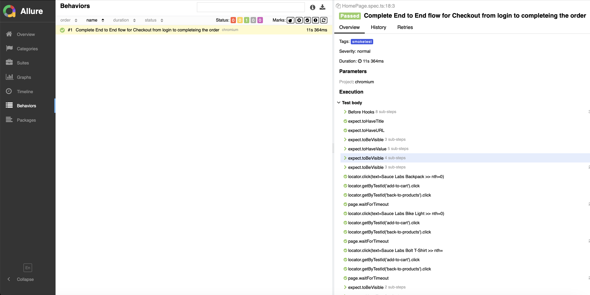
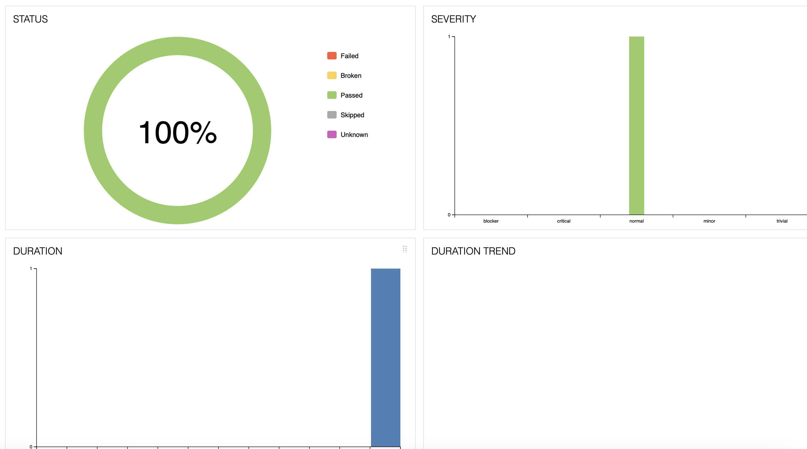
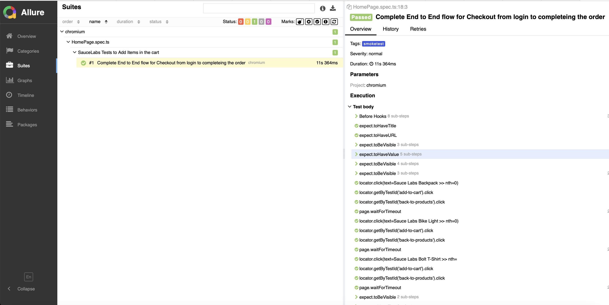

# Automation Framework using Playwright

## Overview

This project implemented an automation framework using the Playwright test framework. This framework covers scenarios such as logging in Saurce Labs, adding items to the cart, Verifying items on the cart,verifying prices, and completing a checkout process.

End to End Use Case Flow:

1. Navigate to the Swag Labs website.
2. Log in with valid credentials, verify various assertion checks with in login
3. Add items to the cart.
4. Verify items in the cart.
5. Verify Checkout page price, summary and items description
5. Proceed to checkout and fill in the necessary information.
6. Complete the checkout process.
7. Verify the order completion page.

## Prerequisites

To set up and run the framework, ensure that you have the following installed:

1. **Node.js**: Version 14 or higher
2. **Playwright**: Install using npm

### Installing Node.js

If you do not have Node.js installed, you can download and install it from the [official Node.js website](https://nodejs.org/).

### Installing Playwright

Once you have Node.js installed, you can install Playwright globally using npm `npm install -g playwright`

### Project Structure

**Pages**: Pages is the folder where it contains the HomePage class methods, This is the page where written all functions and thier assertions.

**Tests**: Tests folder will contains all tests which are written as part of this use case, current created the homepage.spec.js file where it contain the entire end to end flow

**Utils**: This is folder, which contains logging tests file and credentials.json file, Logged class used to added the logges which running the tests and added all logs on the test-log.txt file, Also credentials file where we have stored the all user credentials.

**Reporting**: As part of this framework design, integrated the `allure-playwright` reporting system. Reports generated in the folder.

**GenerateReports**: As part of this framework design, integrated the `allure-playwright` reporting system. Reports generated in the folder.

***Run Commands to Generate reports***

1. Install the allure-playwright reports using this command `npm i -D allure-playwright`
2. Install CommandLine reports `npm install -D allure-commandline`
3. make sure you have to install java and need to setup home path
4. To generate allure reports, run this command `npx allure generate ./allure-results --clean` and then `npx allure generate ./allure-results `
5. To open allure reports run this command `npx allure open ./allure-report `

